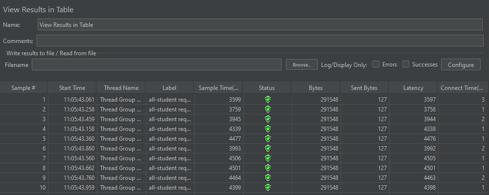
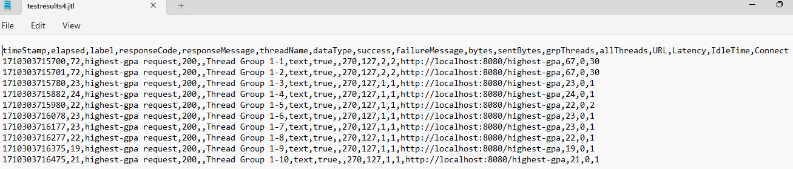

Nama: Sabrina Aviana Dewi
 
NPM: 2206030520
 
Kelas: Adpro-B
 
<h3>Module 5</h3>

<h4> Before Optimizing </h4>
**all-student request**

**all-student-name request**

**highest-gpa request**

**all-student request CLI**

**all-student-name request CLI**

**highest-gpa request CLI**

<h4> After Optimizing </h4>
Sudah lebih cepat 20% dibandingkan sebelum optimizing.

**all-student request**

**all-student-name request**

**highest-gpa request**

<h4> Reflection </h4>

1. What is the difference between the approach of performance testing with JMeter and profiling with IntelliJ Profiler in the context of optimizing application performance?
 
Jawaban: 
 
JMeter digunakan untuk mengukur performa aplikasi dengan cara mensimulasikan beban kerja yang tinggi pada aplikasi (aplikasi digunakan oleh banyak orang pada saat yang bersamaan), sedangkan Intellij Profiler digunakan untuk mencari tahu bagian dari aplikasi yang menyebabkan performa aplikasi menjadi buruk atau lambat.
  

2. How does the profiling process help you in identifying and understanding the weak points in your application?
 
Jawaban:
 
Proses _profiling_ akan mengumpulkan data dan menganalisis bagian-bagian yang menjadi _weak points_ dan membuat aplikasi menjadi lambat. Informasi yang kita peroleh dapat berupa _CPU usage_, _memory allocation_, _garbage collection activity_, dan _thread concurrency_.
  

3. Do you think IntelliJ Profiler is effective in assisting you to analyze and identify bottlenecks in your application code?
 
Jawaban:
 
Menurut saya, efektif karena kita bisa melihat bagian mana yang memakan waktu eksekusi yang lama. Selain itu, tab `Method List` memberikan kita informasi mengenai `Execution time`. Jika terdapat _method_ yang kita optimisasi, kita bisa melihat perubahan `Diff execution time` dari _method_ tersebut.
  

4. What are the main challenges you face when conducting performance testing and profiling, and how do you overcome these challenges?
 
Jawaban:
 
Tantangan yang saya hadapi adalah saat melakukan optimisasi karena harus memikirkan _refactoring_ apa yang harus dilakukan pada suatu bagian. agar performa aplikasi menjadi lebih baik.
  

5. What are the main benefits you gain from using IntelliJ Profiler for profiling your application code?
 
Jawaban:
 
Manfaat yang saya rasakan adalah idak perlu menggunakan *third party apps* lainnya untuk melakukan *profiling* sehingga tidak perlu melakukan _setup_ yang rumit untuk _profiling_. Selain itu, `Diff execution time` membuat saya tidak perlu menghitung manual.
  

6. How do you handle situations where the results from profiling with IntelliJ Profiler are not entirely consistent with findings from performance testing using JMeter?
 
Jawaban:
 
Saya akan mengecek kembali konfigurasi pada aplikasi untuk JMeter dan bagian aplikasi yang mengalami inkonsisten. Lalu, saya akan memastikan ke teman-teman yang lain apakah di mereka terjadi kasus yang sama atau tidak.
  

7. What strategies do you implement in optimizing application code after analyzing results from performance testing and profiling? How do you ensure the changes you make do not affect the application's functionality?
 
Jawaban:
- Mengurangi Pemanggilan Database:
  Pada _method_ `getAllStudentsWithCourses()`saya menggunakan `studentCourseRepository.findAll()` untuk langsung mendapatkan semua data hubungan antara mahasiswa dan kursus dari _database_ dalam satu pemanggilan dibanding sebelumnya pada setiap iterasi. Lalu, saya memanfaatkan `HashMap` untuk ID mahasiswa sehingga cukup iterasi `StudentCourse` untuk mencari mahasiswa yang sesuai dalam `HashMap`.
- Perbaiki Struktur Data untuk Alokasi Memori:
  Pada _method_ `joinStudentNames()`, operasi `concatenation` atau `+=` pada String memerlukan alokasi
  memori tambahan karena String bersifat _immutable_ dan membuat objek baru setiap kali konkatensi dilakukan. Dengan begitu,
  sebaiknya menggunakan `StringBuilder` untuk mengurangi alokasi memori yang tidak perlu.
- Optimisasi _Query_:
  Pada _method_ `findStudentWithHighestGpa()` saya menggunakan _query_ `SELECT * FROM students ORDER BY gpa DESC LIMIT 1` yang diterapkan pada `StudentRepository`. _Query_ ini mengambil mahasiswa dengan IPK tertinggi dengan mengurutkan secara menurun dan ambil satu anggota pertama.
